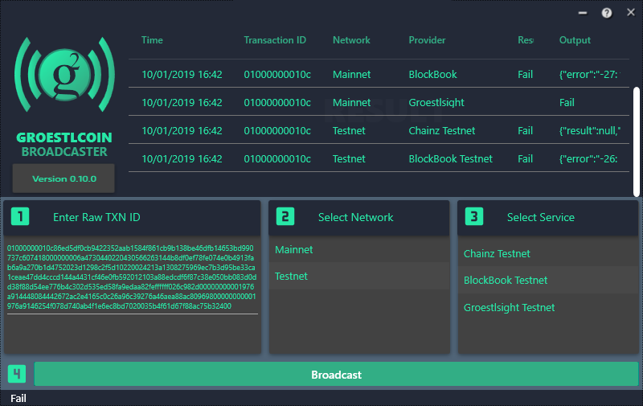

# SharpPusher
A simple GUI to broadcast Groestlcoin transactions to the network.

**Packages needed:** Newtonsoft.Json, MaterialDesignThemes, MaterialDesignColors

## Features

1. Pushing GRS raw transaction through following services:
* Groestlsight
* Blockbook
* Chainz.CryptoID
2. Pushing Testnet GRS raw  transaction through following services:
* Groestlsight Testnet
* Blockbook Testnet
* Chainz.CryptoID Testnet

### Don't forget to leave your feedback, Thank you.
**Wanna help?** 

Then review the code and leave your feedback.

